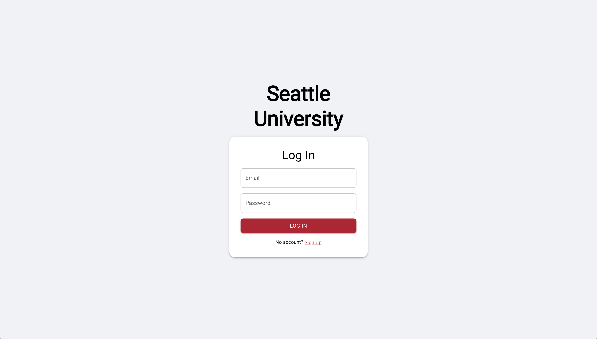
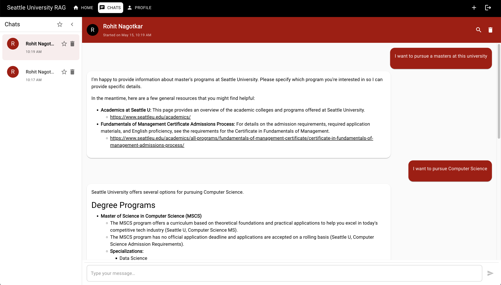
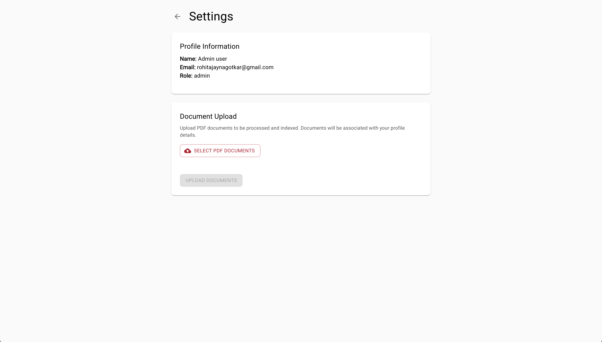

# Seattle University RAG Chatbot

<div align="center">
  
  <h3>Retrieval-Augmented Generation Chatbot for Seattle University</h3>
</div>

A Retrieval-Augmented Generation (RAG) chatbot tailored to Seattle University's official resources. This intelligent assistant provides accurate, relevant information sourced exclusively from SU's official documents and web content.

## 🎯 Objective & Problem Statement

Traditional search methods often lead to information overload, making it difficult for users to find precise answers to their questions about academic programs, campus services, and university policies.Seattle University an institution that caters to many also requires a solution to provide accurate, accessible information to students, faculty, and the public while reducing the load on administrative staff.

This RAG chatbot addresses these challenges by:
- **Centralizing information access** from diverse university sources into a single conversational interface
- **Ensuring factual accuracy** by grounding all responses in official SU documents only
- **Reducing administrative overhead** by automating answers to common questions
- **Improving user experience** through natural language interaction instead of keyword searching
- **Providing 24/7 availability** for information that would otherwise require staff assistance during business hours

The solution combines modern AI capabilities with strict data governance to create a trustworthy, useful resource that reflects Seattle University's commitment to service excellence and technological innovation.

## 🚀 Features

- **🔍 Contextual Retrieval**: All answers are grounded in SU materials only
- **💬 Chat Interface**: Multiple chat sessions with history, favorite, and delete functionality
- **🔒 Auth & User Management**: JWT-based login/signup with user/admin roles
- **☁️ Firestore Logging**: Persistent chat storage per user
- **📱 Responsive Design**: Desktop & mobile support with smooth animations
- **🎨 On-Brand Theme**: SU red/black/white palette matching Seattle University's branding

## 📦 Tech Stack

<div>
  
  
  
  
  
  
  
</div>

### Backend Components
- **Vector Storage**: Pinecone
- **Embedding & Retrieval**: LlamaIndex with HuggingFace MiniLM embeddings
- **LLM**: Google Gemini API
- **API**: Flask with JWT authentication
- **Database**: Firebase Firestore (chat logs, user management)

### Frontend Components
- **Framework**: React with TypeScript
- **UI Library**: Material-UI (MUI)
- **Routing**: React Router
- **State Management**: React Hooks

## 🛠️ Getting Started

### Prerequisites

- Python 3.9 or higher
- Node.js 16 or higher
- npm or yarn
- Pinecone account and API key
- Google Cloud project with Gemini API enabled
- Firebase project with Firestore enabled and service account credentials

### Clone Repository

```bash
git clone <repository-url>
cd su-rag
```

### Backend Setup

1. **Set up Python environment**:
```bash
# Using virtualenv
python -m venv venv
source venv/bin/activate  # On Windows: venv\Scripts\activate

# OR using pipenv
pipenv install
pipenv shell
```

2. **Install backend dependencies**:
```bash
pip install -r requirements.txt
```

3. **Environment configuration**:
Create a `.env.local` file in the project root:
```
PINECONE_API_KEY=your_pinecone_api_key
PINECONE_ENV=your_pinecone_environment
PINECONE_INDEX=su-rag-pipeline
GEMINI_API_KEY=your_gemini_api_key
FIREBASE_CREDENTIALS_PATH=path/to/firebase-credentials.json
JWT_SECRET_KEY=your_jwt_secret_key
```

4. **Run the Flask backend**:
```bash
python app.py
```

### Frontend Setup

1. **Navigate to the UI directory**:
```bash
cd su-rag-ui
```

2. **Install frontend dependencies**:
```bash
npm install
# OR
yarn install
```

3. **Environment configuration**:
Create a `.env` file in the `su-rag-ui` directory:
```
REACT_APP_API_BASE=http://localhost:5050
```

4. **Start the development server**:
```bash
npm start
# OR
yarn start
```

## 📝 Usage

1. **Account Creation**: Register via the signup page
2. **Login**: Use your credentials to authenticate
3. **Start New Chat**: Click the "+" icon to start a new conversation
4. **Ask Questions**: Type questions about Seattle University
5. **Manage Chats**:
   - Star favorite conversations
   - Delete unwanted chats
   - Filter by favorites

## 📷 Screenshots

<div align="center">
  <p><i>Login Screen</i></p>
  
  
  <p><i>Chat Interface</i></p>
  
  
  <p><i>Admin View</i></p>
  
</div>

## 👨‍💻 Contributors

- [Rohit Nagotkar](https://github.com/rxhxt)

## 📄 License

This project is licensed under the Apache License 2.0 - see the [LICENSE](LICENSE) file for details.

Licensed under the Apache License, Version 2.0 (the "License");
you may not use this file except in compliance with the License.
You may obtain a copy of the License at

    http://www.apache.org/licenses/LICENSE-2.0

Unless required by applicable law or agreed to in writing, software
distributed under the License is distributed on an "AS IS" BASIS,
WITHOUT WARRANTIES OR CONDITIONS OF ANY KIND, either express or implied.
See the License for the specific language governing permissions and
limitations under the License.
